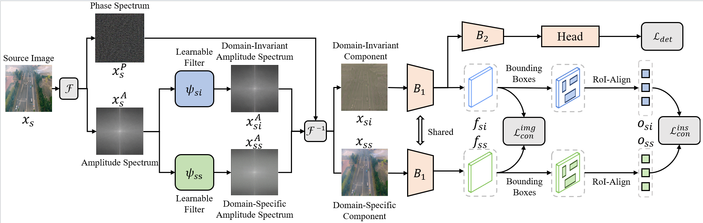
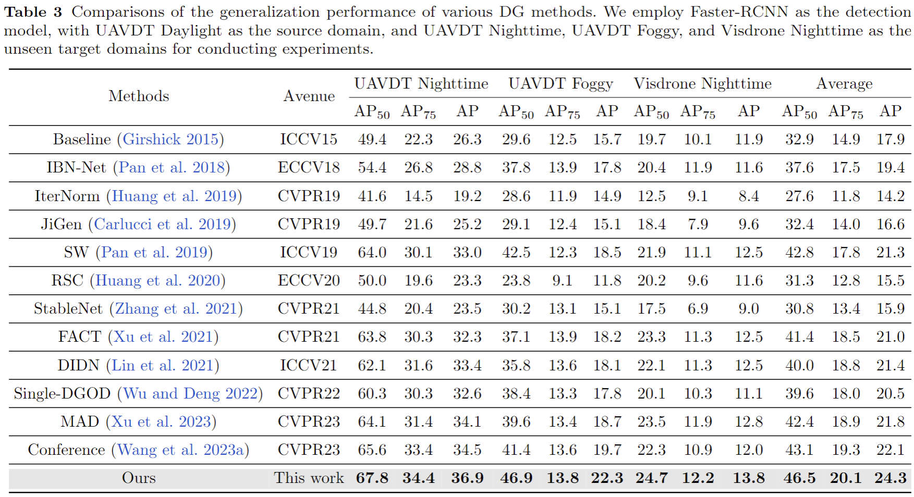

# Towards Generalized UAV Object Detection: A Novel Perspective from Frequency Domain Disentanglement

We have released the code for our paper "Towards Generalized UAV Object Detection: A Novel Perspective from Frequency Domain Disentanglement" in IJCV 2024. It is an extension of our CVPR 2023 paper "Generalized UAV Object Detection via Frequency Domain Disentanglement", with our code using Faster-RCNN as the exemplified detection network.

<div align=center>

</div>

<div align=center>

</div>

### Datasets

[[Download link for UAVDT] https://pan.baidu.com/s/1oqfCJr3T_l3wFM9wpmHW7g (pwd: shdl) ]

[[Download link for VisDrone2019] https://pan.baidu.com/s/1KbpgWTIoWojUlTZXHl3gaw (pwd: xbkt) ]

## Install

Please refer to the requirements.txt file in the directory, where we have listed all the dependencies required for setting up the environment.

## Model Weight

[[Download link] https://pan.baidu.com/s/171LJz9gHNhrAZCzd3ZoDvg (pwd: 5jno) ]

## Structure

The folder structure should be organized as follows:

```
├── cfgs
├── data
│   ├── UAVDT_Faster
│   │   ├── Annotations (40409 xml in total)
│   │   ├── ImageSets
│   │   │   ├── Main
│   │   │   │   ├── test_dark.txt
│   │   │   │   ├── test_haze.txt
│   │   │   │   ├── train.txt
│   │   ├── JPEGImages (40409 img in total)
│   ├── VisDrone2019_Faster
│   │   ├── Annotations (8251 xml in total)
│   │   ├── ImageSets
│   │   │   ├── Main
│   │   │   │   ├── test_illumination.txt
│   │   │   │   ├── train.txt
│   │   ├── JPEGImages (8251 img in total)
├── imgs
├── lib
├── output (for evaluation output)
├── model_zoo
│   ├── Faster.pth
│   ├── resnet50.pth
...
```

## Evaluation

```bash
cd UAV-Frequency
unzip lib.zip -d lib
mkdir output
mkdir model_zoo
mkdir data
cd lib
python setup.py build develop
cd ..
python test_net.py --cuda
```
